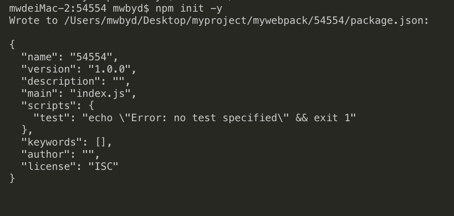

# webpack 学习记录文档

## 一、安装

### 前提条件

确认自己装了最新版的<a herf="https://nodejs.org/en/">node.js</a>，写此篇文档时我所用的 node 版本为`v10.15.1`，webpack 版本为`v4.39.3`，webpack-cli 的版本为`v3.3.7`

### 安装 webpack

#### 第一步：初始化项目

使用`npm init -y`初始化项目生成 package.json 文件



#### 第二步: 下载

使用`npm i webpack webpack-cli —save` 下载

#### 第三步: 修改 package.json 文件

```json
{
  "name": "mywebpack",
  "version": "1.0.0",
  "main": "index.js",
  "scripts": {
    "test": "echo \"Error: no test specified\" && exit 1",
    "build": "webpack --config webpack.config.js"
  },
  "keywords": [],
  "author": "",
  "license": "ISC",
  "dependencies": {
    "webpack": "^4.39.3",
    "webpack-cli": "^3.3.7"
  },
  "devDependencies": {},
  "description": ""
}
```

#### 第四步: 入口以及输出配置 webpack

在 package.json 的同级目录下创建 webpack.config.js 文件

```javascript
const path = require("path");
module.exports = {
  // 入口文件
  entry: {
    index: "./src/main.js"
  },
  // 输出文件
  output: {
    filename: "build.js",
    path: path.join(__dirname, "/dist") // 输出文件路径
  }
};
```

运行 `npm run build`就可以使用 webpack 进行打包了

## 二、webpack 配置

### 资源管理

#### 加载 css

使用`npm i css-loader style-loader` ，具体可以看案例<a href="./demo-css">demo-css</a>

webpack 配置

```javascript
const path = require("path");
module.exports = {
  entry: {
    index: "./src/main.js"
  },
  output: {
    filename: "build.js",
    path: path.join(__dirname, "/dist") // 输出文件路径
  },
  module: {
    rules: [
      {
        test: /\.css$/,
        loader: "style-loader!css-loader"
      } //.css 文件使用 style-loader 和 css-loader 来处理
    ]
  }
};
```

#### 加载图片

使用`npm i file-loader url-loader`，具体可以看案例<a href="./demo-img">demo-img</a>

webpack 配置

```javascript
const path = require("path");
module.exports = {
  // 入口文件
  entry: {
    index: "./src/main.js"
  },
  // 输出文件
  output: {
    filename: "build.js",
    path: path.join(__dirname, "/dist") // 输出文件路径
  },
  module: {
    rules: [
      {
        test: /\.(png|jpg)$/,
        loader: "url-loader?limit=8192"
      } //图片文件使用 url-loader 来处理，小于8kb的直接转为base64
    ]
  }
};
```

#### 加载 JSX 语法（React）

使用 `npm i react react-dom`安装 react 相关，在使用`npm i babel-preset-react babel-preset-es2015 babel-loader babel-core`安装相关 babel，具体见案例<a href="./demo-react">demo-react</a>

webpack 配置

```javascript
const path = require("path");
module.exports = {
  // 入口文件
  entry: {
    index: "./src/main.js"
  },
  // 输出文件
  output: {
    filename: "build.js",
    path: path.join(__dirname, "/dist") // 输出文件路径
  },
  module: {
    rules: [
      {
        test: /\.jsx?$/,
        exclude: /node_modules/,
        loader: "babel-loader", //.jsx文件使用babel处理
        query: {
          presets: ["es2015", "react"]
        }
      }
    ]
  }
};
```

#### css 模块化

使用`npm i css-loader style-loader`，具体见案例<a href="./demo-css-module">demo-css-module</a>

webpack 配置

```javascript
const path = require("path");
module.exports = {
  entry: {
    index: "./src/main.jsx"
  },
  output: {
    filename: "build.js",
    path: path.join(__dirname, "/dist") // 输出文件路径
  },
  module: {
    rules: [
      {
        test: /\.jsx?$/,
        exclude: /node_modules/,
        loader: "babel-loader", //.jsx文件使用babel处理
        query: {
          presets: ["es2015", "react"]
        }
      },
      {
        test: /\.css$/,
        loader: "style-loader!css-loader?modules"
      }
    ]
  }
};
```

#### 压缩打包

使用`npm i uglifyjs-webpack-plugin`下载相关处理，具体见案例<a href="./demo-compress">demo-compress</a>

webpack 配置

```javascript
var path = require("path");
var UglifyJsPlugin = require("uglifyjs-webpack-plugin");
var HtmlwebpackPlugin = require("html-webpack-plugin");
module.exports = {
  entry: "./src/main.js",
  output: {
    filename: "build.js",
    path: path.join(__dirname, "/dist")
  },
  plugins: [
    // 打包的时候生成html
    new HtmlwebpackPlugin({
      title: "Webpack-demos"
    })
  ],
  optimization: {
    minimizer: [
      new UglifyJsPlugin({
        uglifyOptions: {
          compress: true
        }
      })
    ]
  }
};
```

### 输出管理

#### 打包自动生成 html

使用`npm i html-webpack-plugin`下载对应的处理包，具体可以看案例<a href="./demo-html">demo-html</a>

webpack 配置

```javascript
const path = require("path");
var HtmlwebpackPlugin = require("html-webpack-plugin");
module.exports = {
  // 入口文件
  entry: {
    index: "./src/main.js"
  },
  // 输出文件
  output: {
    filename: "build.js",
    path: path.join(__dirname, "/dist") // 输出文件路径
  },
  module: {
    rules: [
      {
        test: /\.(png|jpg)$/,
        loader: "url-loader?limit=8192"
      } //图片文件使用 url-loader 来处理，小于8kb的直接转为base64
    ]
  },
  plugins: [
    // 打包的时候生成html
    new HtmlwebpackPlugin({
      title: "Webpack-demos"
    })
  ]
};
```

#### 清理上次打包生成的文件

使用`npm install clean-webpack-plugin --save-dev`下载相关依赖，具体见案例<a href="./demo-cleanDist">demo-cleanDist</a>

配置 webpack

```javascript
var path = require("path");
var HtmlwebpackPlugin = require("html-webpack-plugin");
var { CleanWebpackPlugin } = require("clean-webpack-plugin");
module.exports = {
  entry: "./src/main.js",

  plugins: [
    // 每次打包清理dist文件夹，然后生成新的dist文件夹
    new CleanWebpackPlugin(),
    // 打包的时候生成html
    new HtmlwebpackPlugin({
      title: "Webpack-demos"
    })
  ],
  output: {
    filename: "build.js",
    path: path.join(__dirname, "/dist")
  }
};
```

### 开发

#### 热更新

在打包生成 html 时自己启动，并在每次修改代码后自动更新页面

```javascript
var path = require("path");
var HtmlwebpackPlugin = require("html-webpack-plugin");
module.exports = {
  entry: "./src/main.js",
  output: {
    filename: "build.js",
    path: path.join(__dirname, "/dist")
  },
  plugins: [
    // 打包的时候生成html
    new HtmlwebpackPlugin({
      title: "Webpack-demos"
    })
  ],
  // 热更新
  devServer: {
     contentBase: path.join(__dirname, "/dist"),
    compress: true, // 启动压缩
    port: 9999,// 启动服务端口
    hot:true ,// 启动热加载
  }
};
```
